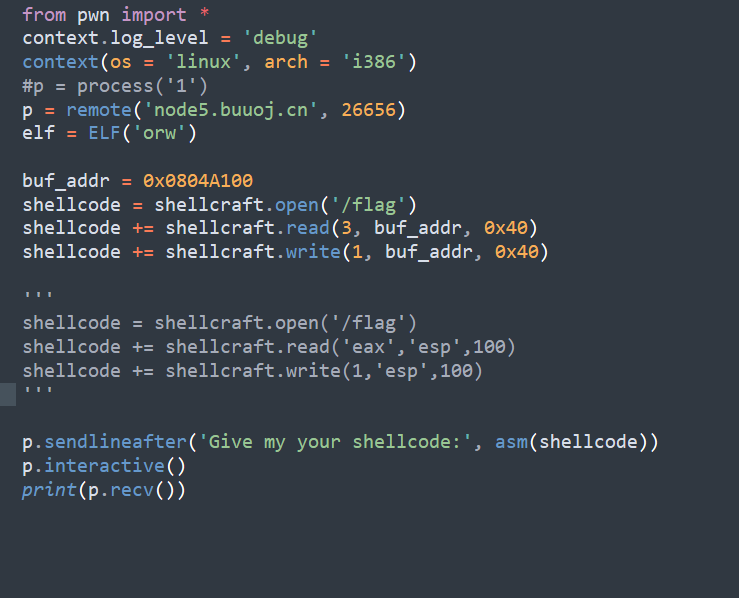
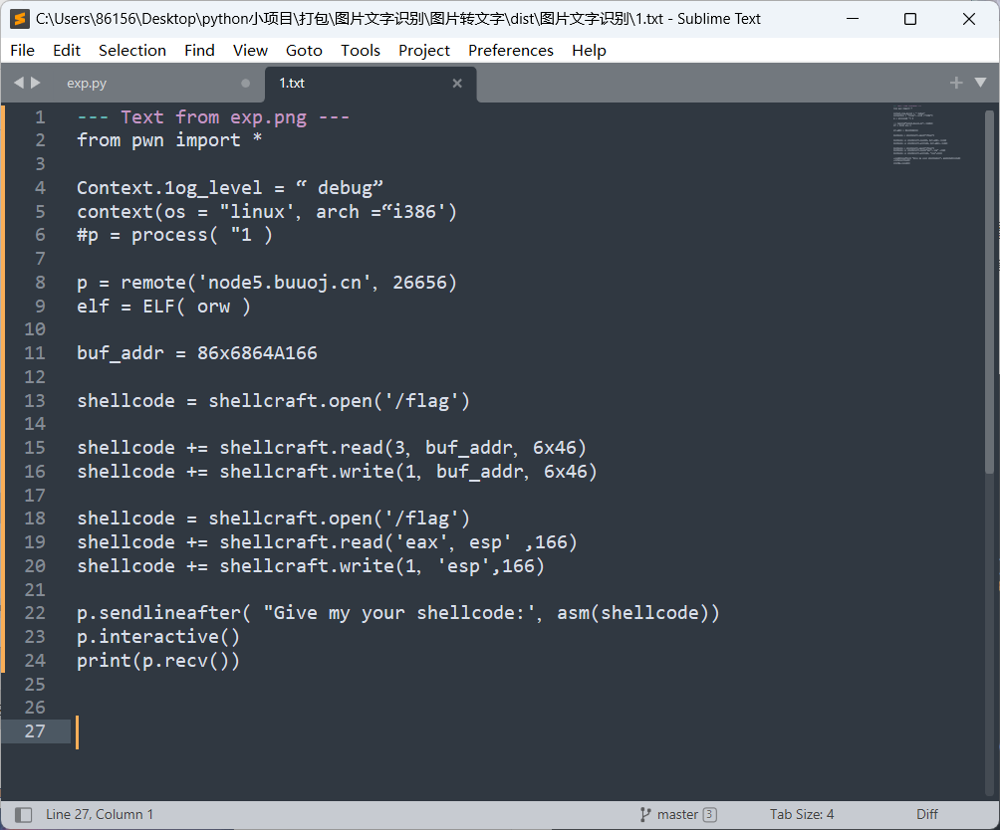
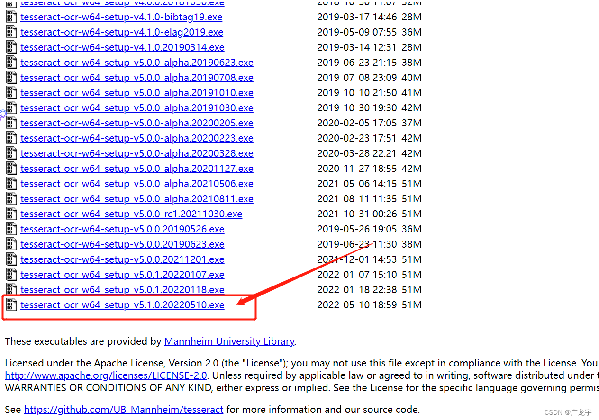
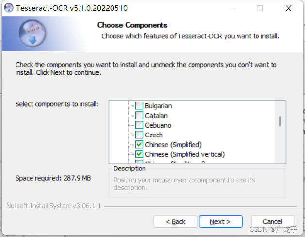
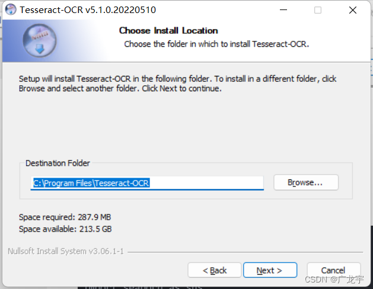
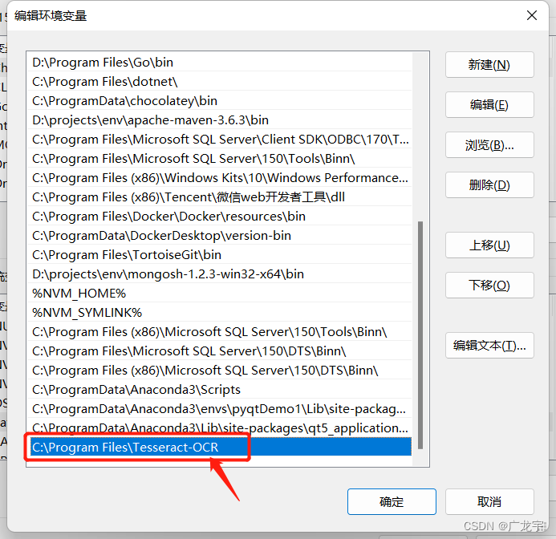
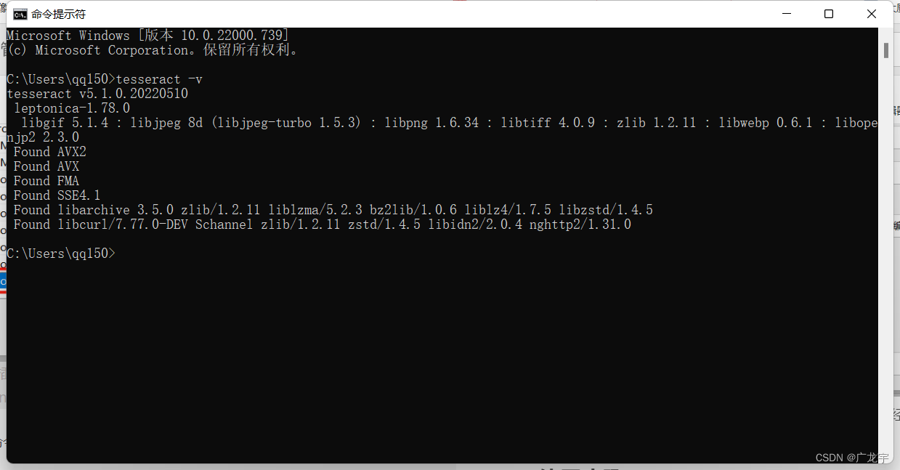

# 图片文字识别工具2.0

2.0添加了程序框的提示功能

### By [Xi17g3](https://youyuanhui123.github.io/)

当我们在网上查询代码资源的时候，发现代码是用图片形式展示难免有写头痛，那就做一个图片提取文字的工具吧，能够省去部分时间。

样图

效果图

### 如何使用

**环境配置**

### [安装tesseract软件](https://digi.bib.uni-mannheim.de/tesseract/)

建议下载最新的版本，版本越高越好

接下来根据需求安装中文的语言包`用来识别中文`，需要滑到下面，选择中文，我这里横排简体中文和竖排简体中文都选择了，完成后点击next

推荐默认的安装路径

添加环境变量，就是你安装到的那个文件夹路径，直接加到path里面，**必须严格配置路径为**：

~~~
C:\Program Files\Tesseract-OCR
~~~

然后在命令行运行`tesseract -v`，如果和下图一样，说明你已经安装成功了，可以愉快的使用了

**exe操作步骤**

~~~
将你需要识别的图片复制进image文件夹里面，然后双击运行exe文件即可在1.txt查看output
~~~

### 赞赏作者

